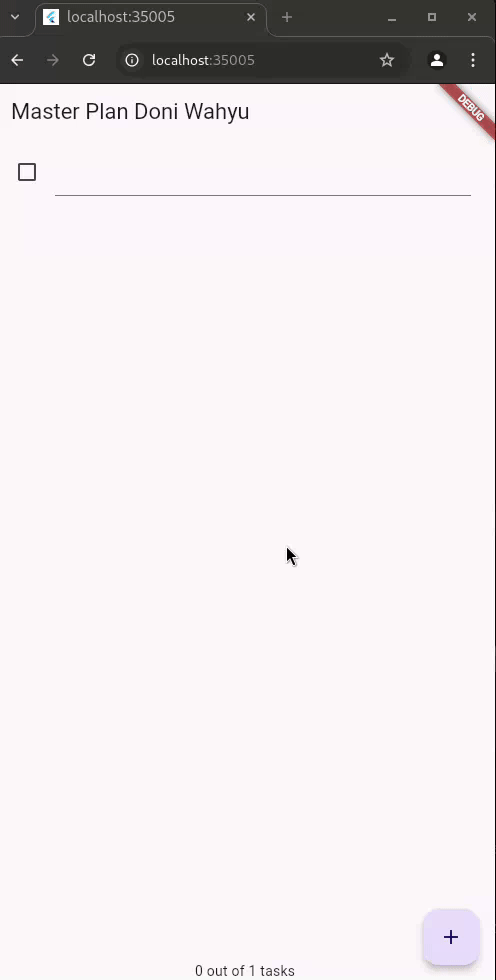

# #10 | Dasar State Management

## Doni Wahyu Kurniawan

## TI-3H | 2241720015 | 08

## Praktikum 1: Dasar State dengan Model-View

## Tugas Praktikum 1: Dasar State dengan Model-View

1. Selesaikan langkah-langkah praktikum tersebut, lalu dokumentasikan berupa GIF hasil akhir praktikum beserta penjelasannya di file README.md! Jika Anda menemukan ada yang error atau tidak berjalan dengan baik, silakan diperbaiki.

2. Jelaskan maksud dari langkah 4 pada praktikum tersebut! Mengapa dilakukan demikian?
    > Langkah 4 dilakukan untuk menyederhanakan impor model, sehingga pengembang cukup mengimpor satu file data_layer.dart untuk mengakses semua model, membuat kode lebih rapi dan mudah dikelola.
3. Mengapa perlu variabel plan di langkah 6 pada praktikum tersebut? Mengapa dibuat konstanta ?
    > Variabel plan digunakan untuk menyimpan data rencana yang akan ditampilkan di layar. Dibuat sebagai konstanta untuk memberikan nilai awal yang aman dan immutable sebelum diperbarui melalui interaksi pengguna.
4. Lakukan capture hasil dari Langkah 9 berupa GIF, kemudian jelaskan apa yang telah Anda buat!
    > Langkah 9 membuat widget _buildTaskTile untuk menampilkan setiap tugas dengan Checkbox dan TextFormField. Checkbox memungkinkan pengguna menandai tugas selesai, dan TextFormField memungkinkan pengeditan deskripsi. Metode setState memperbarui daftar tugas secara dinamis saat pengguna berinteraksi.
5. Apa kegunaan method pada Langkah 11 dan 13 dalam lifecyle state ?
    > - Langkah 11 (initState): Method ini dipanggil saat instance State pertama kali dibuat. initState() digunakan untuk inisialisasi variabel atau setup yang diperlukan sebelum widget ditampilkan. Dalam kasus ini, scrollController diinisialisasi dan didaftarkan listener untuk menghapus focus dari semua TextField saat event scroll terjadi, sehingga mempermudah interaksi pengguna dengan daftar yang panjang.
    > - Langkah 13 (dispose): Method ini dipanggil saat instance State akan dihapus dan widget tidak lagi digunakan. dispose() digunakan untuk membersihkan sumber daya, seperti menghapus listener pada scrollController dan mengosongkan memori, agar tidak ada kebocoran memori (memory leak).

## Praktikum 2: Mengelola Data Layer dengan InheritedWidget dan InheritedNotifier

## Tugas Praktikum 2: InheritedWidget

1. Selesaikan langkah-langkah praktikum tersebut, lalu dokumentasikan berupa GIF hasil akhir praktikum beserta penjelasannya di file README.md! Jika Anda menemukan ada yang error atau tidak berjalan dengan baik, silakan diperbaiki sesuai dengan tujuan aplikasi tersebut dibuat.
    > InheritedWidget adalah widget untuk berbagi data ke widget turunan. InheritedNotifier digunakan karena menggabungkan fungsi InheritedWidget dengan ValueNotifier untuk pemberitahuan perubahan state secara efisien.
2. Jelaskan mana yang dimaksud InheritedWidget pada langkah 1 tersebut! Mengapa yang digunakan InheritedNotifier?
    > Method completedCount menghitung tugas yang selesai, dan completenessMessage menampilkan progres penyelesaian tugas. Ini membantu pengguna melihat progres tugas dengan cepat.
3. Jelaskan maksud dari method di langkah 3 pada praktikum tersebut! Mengapa dilakukan demikian?
    > Menampilkan daftar tugas dengan scroll dan progres di footer menggunakan SafeArea agar tidak tertutup elemen antarmuka lainnya.
4. Lakukan capture hasil dari Langkah 9 berupa GIF, kemudian jelaskan apa yang telah Anda buat!
    Kumpulkan laporan praktikum Anda berupa link commit atau repository GitHub ke dosen yang telah disepakati !

## Praktikum 3: Membuat State di Multiple Screens

## Tugas Praktikum 3: State di Multiple Screens

1. Selesaikan langkah-langkah praktikum tersebut, lalu dokumentasikan berupa GIF hasil akhir praktikum beserta penjelasannya di file README.md! Jika Anda menemukan ada yang error atau tidak berjalan dengan baik, silakan diperbaiki sesuai dengan tujuan aplikasi tersebut dibuat.
2. Berdasarkan Praktikum 3 yang telah Anda lakukan, jelaskan maksud dari gambar diagram berikut ini!
    > Diagram tersebut menggambarkan struktur widget tree dari dua layar berbeda dalam aplikasi Flutter yang dibuat pada Praktikum 3, yaitu PlanCreatorScreen dan PlanScreen, serta bagaimana navigasi dilakukan di antara keduanya.
    > - Diagram kiri (PlanCreatorScreen): Menunjukkan struktur widget tree dari layar PlanCreatorScreen. Ini adalah layar awal di mana pengguna dapat membuat rencana baru. MaterialApp membungkus aplikasi dan PlanProvider menyediakan state berupa daftar rencana (List< Plan>) untuk seluruh aplikasi. Layar ini memiliki PlanCreatorScreen yang di dalamnya terdapat Column yang membungkus TextField (untuk input) dan ListView (untuk menampilkan daftar rencana).
    > - Navigator Push: Panah di tengah menunjukkan navigasi dari PlanCreatorScreen ke PlanScreen menggunakan Navigator.push(). Ini berarti ketika pengguna memilih atau menekan rencana dari daftar, mereka diarahkan ke layar detail PlanScreen.
    > - Diagram kanan (PlanScreen): Menunjukkan struktur widget tree dari layar PlanScreen, yang menampilkan detail dari rencana yang dipilih. MaterialApp membungkus aplikasi dan mengarahkan ke PlanScreen. Layar ini memiliki struktur Scaffold dengan Column yang membungkus Expanded yang menampilkan ListView dan SafeArea yang menampilkan teks status progres rencana (completenessMessage).

3. Lakukan capture hasil dari Langkah 14 berupa GIF, kemudian jelaskan apa yang telah Anda buat!
    > 1. Layar Utama (PlanCreatorScreen):
    >    - Terdapat fitur untuk menambahkan rencana baru melalui TextField di bagian atas layar, di mana input ditangani oleh method addPlan() yang menambah rencana ke daftar dan memperbarui state.
    >    - Di bawah TextField, ListView menampilkan daftar rencana yang sudah dibuat. Jika daftar rencana kosong, akan muncul ikon dan pesan yang menunjukkan belum ada rencana.
    > 2. avigasi ke Layar Detail (PlanScreen):
    >    - Setiap rencana dalam daftar ditampilkan sebagai ListTile yang bisa ditekan untuk navigasi ke layar PlanScreen menggunakan Navigator.push().
    > 3. Layar Detail (PlanScreen):
    >    - Menampilkan detail rencana yang dipilih, termasuk daftar tugas yang terkait dengan rencana tersebut.
    >    - Fitur untuk menambahkan tugas baru dan menandai tugas yang sudah selesai.
    >    - Menampilkan progres jumlah tugas yang selesai dibandingkan total tugas melalui teks completenessMessage.
    > Hasilnya adalah antarmuka yang memungkinkan pembuatan dan pengelolaan rencana, serta navigasi antar layar dengan state yang dikelola di seluruh aplikasi menggunakan InheritedNotifier.
