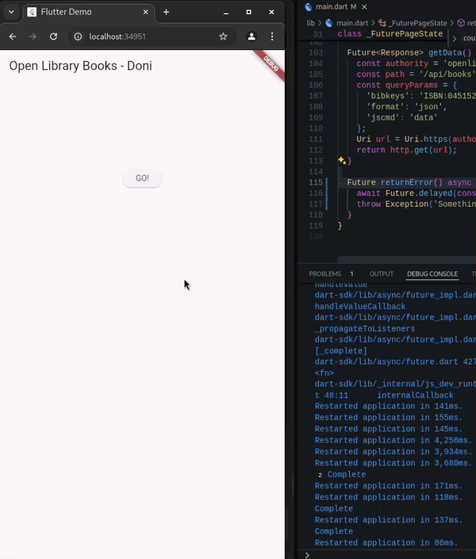
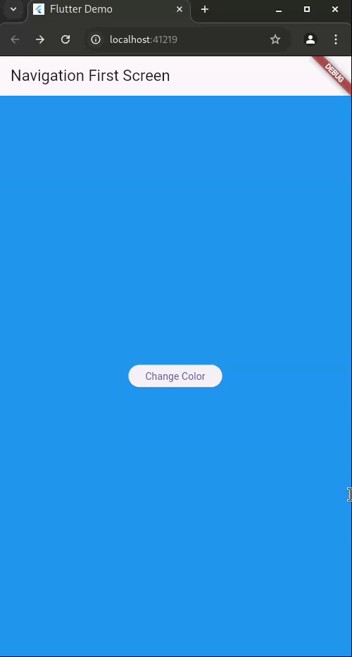
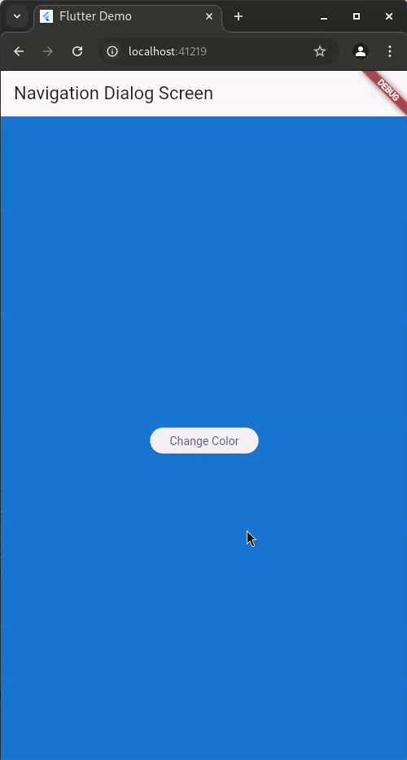

# #11 | Pemrograman Asynchronous

## Doni Wahyu Kurniawan

## TI-3H | 2241720015 | 08

## Praktikum 1: Mengunduh Data dari Web Service (API)

\

**SOAL 3** - Jelaskan maksud kode langkah 5 tersebut terkait substring dan catchError!

> - substring(0, 450):
>
>   Metode substring digunakan untuk mengambil sebagian teks dari sebuah string. Dalam hal ini, value.body.toString().substring(0, 450) berarti bahwa hanya 450 karakter pertama dari hasil respon data (yang telah diubah menjadi string) yang akan ditampilkan. Hal ini berguna jika data yang dikembalikan cukup besar, sehingga kita hanya ingin menampilkan sebagian kecil data tersebut untuk ditampilkan di layar.
>
> - .catchError((_) { ... }):
>
>   Bagian .catchError((_) { ... }) digunakan untuk menangani kemungkinan kesalahan yang terjadi selama pemanggilan fungsi getData(). Jika terjadi error saat mengambil data (misalnya, koneksi internet terputus, server tidak merespons, atau ada masalah lainnya), blok catchError akan dijalankan. Dalam blok ini, nilai result diatur menjadi 'An error occurred' untuk memberi tahu pengguna bahwa terjadi kesalahan. Blok setState(() {}) dipanggil untuk memperbarui antarmuka pengguna agar perubahan ditampilkan.

## Praktikum 2: Menggunakan await/async untuk menghindari callbacks

\

**SOAL 4** - Jelaskan maksud kode langkah 1 dan 2 tersebut!

> - Langkah 1:
>
>   Ketiga method (returnOneAsync, returnTwoAsync, returnThreeAsync) adalah method asynchronous yang masing-masing menunda eksekusi selama 3 detik menggunakan await Future.delayed(const Duration(seconds: 3));. Setelah penundaan, masing-masing method mengembalikan nilai 1, 2, dan 3. Method-method ini digunakan untuk mensimulasikan proses yang memakan waktu, seperti pengambilan data dari server atau operasi asinkron lainnya.
>
> - Langkah 2:
>
>   Method count() digunakan untuk memanggil ketiga method asynchronous tersebut secara berurutan dan menjumlahkan hasilnya. Method ini menunggu hingga returnOneAsync, returnTwoAsync, dan returnThreeAsync selesai dieksekusi (masing-masing dengan penundaan 3 detik), dan mengembalikan total dari ketiga nilai tersebut. Jumlah total yang dihasilkan adalah 1 + 2 + 3, yaitu 6.

## Praktikum 3: Menggunakan Completer di Future

\

**Soal 5** - Jelaskan maksud kode langkah 2 tersebut!
> Langkah 2 bertujuan untuk membuat proses asinkron yang menghasilkan Future dengan nilai 42 setelah 5 detik. Completer digunakan untuk mengendalikan kapan Future tersebut selesai. Method getNumber() mengembalikan Future, dan calculate() menyelesaikannya dengan nilai 42 setelah penundaan 5 detik.

**Soal 6** - Jelaskan maksud perbedaan kode langkah 2 dengan langkah 5-6 tersebut!
>
> - Langkah 2 hanya menangani kasus di mana operasi berjalan dengan sukses dan tidak memiliki mekanisme untuk menangani error.
>
> - Langkah 5-6 menambahkan penanganan error di kedua bagian, yaitu di calculate() dan di onPressed(). Ini membuat aplikasi lebih tangguh karena dapat menangani kondisi error dan memberikan feedback kepada pengguna ketika terjadi kesalahan.

## Praktikum 4: Memanggil Future secara paralel

\

**Soal 8** - Jelaskan maksud perbedaan kode langkah 1 dan 4!
>
> - Langkah 1 (FutureGroup): Memerlukan penanganan manual untuk menambahkan dan menutup grup Future, sehingga lebih kompleks.
>
> - Langkah 4 (Future.wait): Lebih sederhana, cukup dengan satu baris kode untuk menunggu beberapa Future selesai secara paralel.

## Praktikum 5: Menangani Respon Error pada Async Code

\

**Soal 10** - Panggil method handleError() tersebut di ElevatedButton, lalu run. Apa hasilnya? Jelaskan perbedaan kode langkah 1 dan 4!
>
> - Langkah 1: Menggunakan .then(), .catchError(), dan .whenComplete() untuk menangani hasil dan error, serta menjalankan tindakan setelah selesai.
>
> - Langkah 4: Menggunakan try-catch-finally dalam method handleError() untuk menangani error dan aksi selesai dalam satu method yang lebih terstruktur.

## Praktikum 6: Menggunakan Future dengan StatefulWidget

\
\

**Soal 12** - Apakah Anda mendapatkan koordinat GPS ketika run di browser? Mengapa demikian?
> Jika aplikasi dijalankan di browser, GPS memang tidak berfungsi karena browser memiliki keterbatasan dalam mengakses fitur GPS perangkat. Sebaliknya, aplikasi mobile bisa mengakses GPS dengan lancar karena memiliki izin lokasi yang diatur oleh sistem operasi.

## Praktikum 7: Manajemen Future dengan FutureBuilder

\

**Soal 13** - Apakah ada perbedaan UI dengan praktikum sebelumnya? Mengapa demikian?
> UI masih sama saja, karena tidak dilakukan perubahan pada kode UI yang ditampilkan ke pengguna. Hanya saja ada jeda 3 dtik tambahan untuk lokasi ditampilkan akibat ditambahkannya future delayed
**Soal 14** - Apakah ada perbedaan UI dengan langkah sebelumnya? Mengapa demikian?
> Dengan penambahan ini, jika terjadi error, UI akan menampilkan pesan 'Something terrible happened!'

## Praktikum 8: Navigation route dengan Future Function

\

**Soal 16** - Cobalah klik setiap button, apa yang terjadi ? Mengapa demikian ?
> etika tombol di layar kedua diklik, layar kedua menutup dan mengembalikan warna ke layar pertama. Layar pertama menerima warna tersebut dan memperbarui latar belakangnya melalui setState(). Hal ini terjadi karena Navigator.pop() mengembalikan data ke Navigator.push(), yang menunggu hasil dan memperbarui UI.

## Praktikum 9: Memanfaatkan async/await dengan Widget Dialog

\

**Soal 17**- Cobalah klik setiap button, apa yang terjadi ? Mengapa demikian ?
> Saat tombol diklik, warna latar belakang layar berubah sesuai pilihan karena Navigator.pop() mengembalikan warna dan setState() memperbarui UI dengan warna tersebut.