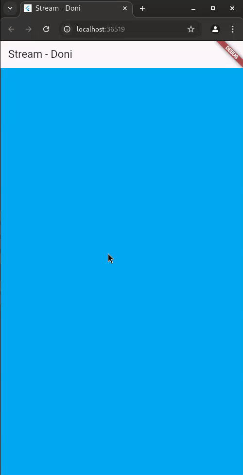
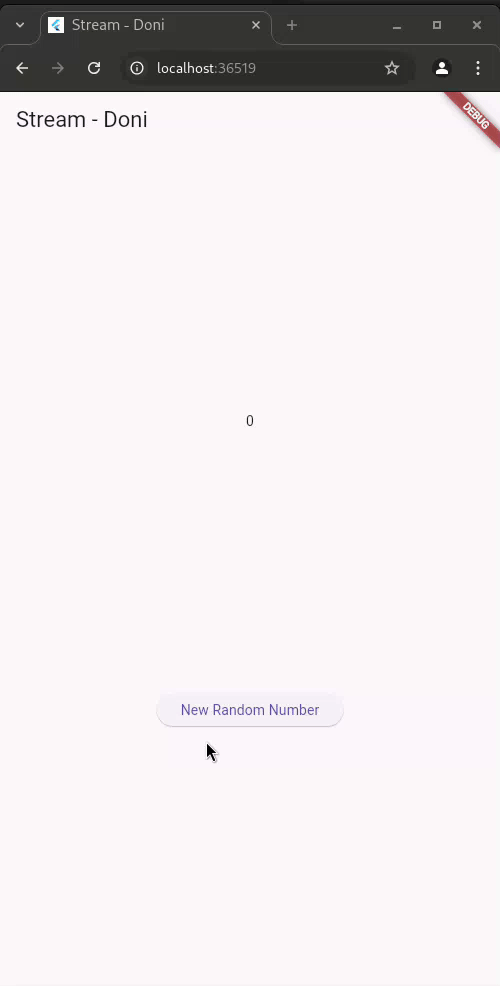
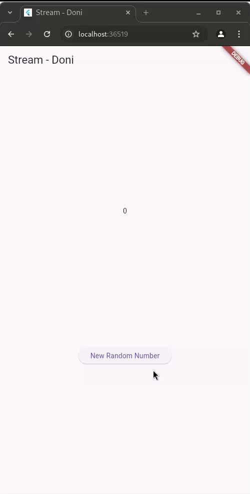
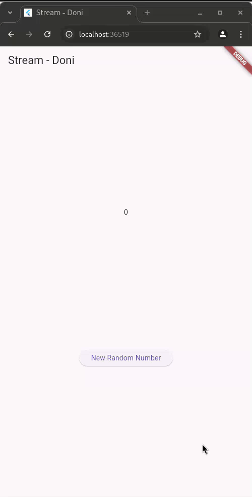
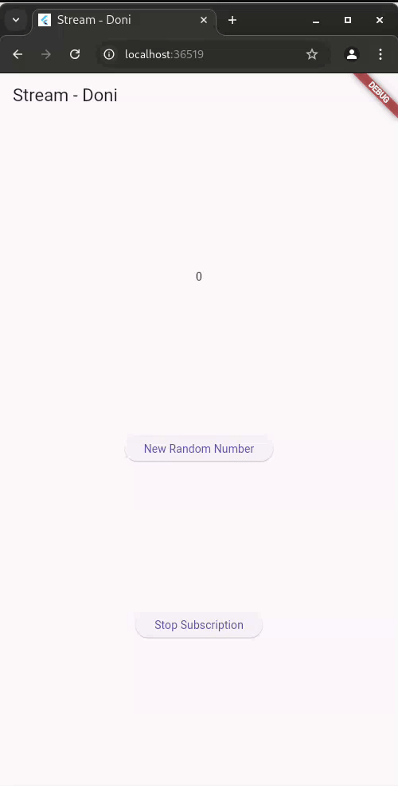
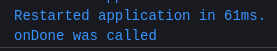
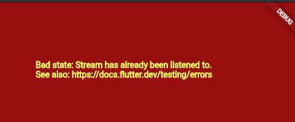
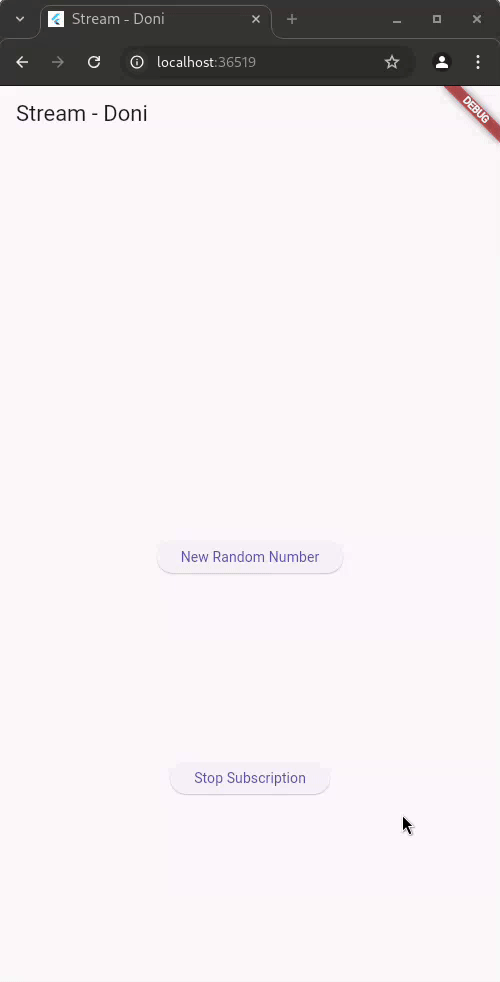
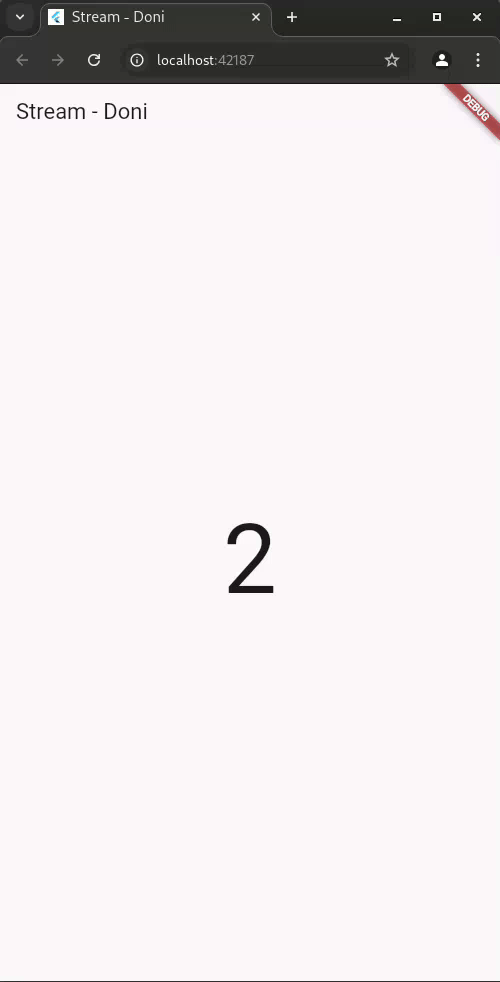
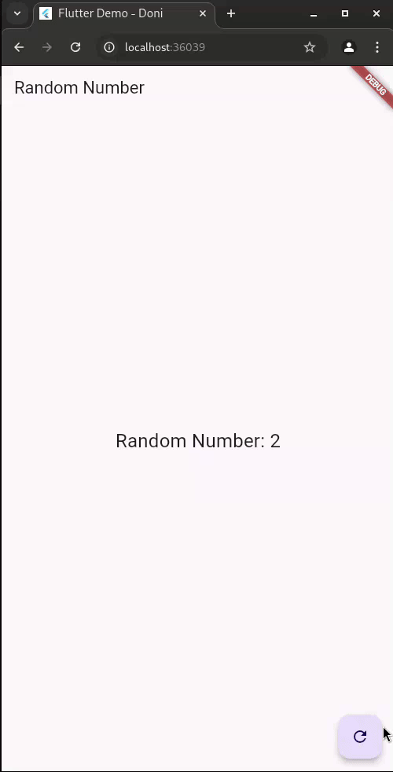

# #12 | Lanjutan State Management dengan Streams

## Doni Wahyu Kurniawan

## TI-3H | 2241720015 | 08

## Praktikum 1: Dart Streams

**SOAL 3** - Jelaskan fungsi keyword yield* pada kode tersebut! Apa maksud isi perintah kode tersebut?

> - Fungsi yield*
>
>   yield* digunakan untuk melimpahkan elemen dari stream lain ke stream yang sedang dibuat. Dalam kode tersebut, yield* Stream.periodic(...) meneruskan elemen yang dihasilkan oleh Stream.periodic langsung ke stream getColors.
>
> - Maksud Kode
>
>   1. Stream.periodic: Membuat stream yang memancarkan nilai setiap 1 detik.
>   2. t % colors.length: Mengambil indeks warna dari daftar colors, berulang dari awal saat mencapai akhir.
>   3. yield*: Meneruskan warna dari Stream.periodic ke stream getColors.

\

**Soal 5** - Jelaskan perbedaan menggunakan listen dan await for (langkah 9) !
>
> - await for:
>   - Membaca stream secara sinkron dalam bentuk perulangan.
>   - Membutuhkan fungsi async.
>   - Cocok untuk pengolahan data terstruktur dan satu listener.
>
> - listen:
>
>   - Mendengarkan stream secara asinkron dengan callback.
>   - Tidak memerlukan fungsi async.
>   - Lebih fleksibel untuk menangani banyak listener atau proses real-time.

## Praktikum 2: Stream Controllers dan Sinks

**Soal 6** - Jelaskan maksud kode langkah 8 dan 10 tersebut!

> - Langkah 8: Edit initState()
>   - Inisialisasi NumberStream dan StreamController.
>   - Mendengarkan data baru dari stream menggunakan stream.listen.
>   - Setiap angka baru yang diterima memperbarui variabel lastNumber dengan setState, sehingga UI diperbarui secara real-time.
>
> - Langkah 10: Tambah addRandomNumber()
>
>   - Menghasilkan angka acak menggunakan Random.
>   - Menambahkan angka acak tersebut ke stream melalui metode addNumberToSink. Angka ini diteruskan ke listener untuk memperbarui UI.

\

**Soal 7** - Jelaskan maksud kode langkah 13 sampai 15 tersebut!
>
> - Langkah 13
>
>   - Fungsi addError() menambahkan error ke stream menggunakan controller.sink.addError('error').
>   - Error ini akan diteruskan ke listener yang mendengarkan stream.
>
> - Langkah 14
>
>   - Menambahkan handler onError ke stream.listen di initState.
>   - Jika stream menerima error, UI akan diperbarui (setState) dengan menampilkan nilai default (contoh: -1).
>
> - Langkah 15
>
>   - Dua baris untuk menghasilkan dan menambahkan angka ke stream dikomentari.
>   - Sebagai gantinya, fungsi addError() dipanggil untuk mengirimkan error ke stream.

\

## Praktikum 3: Injeksi Data ke Streams

**Soal 8** - Jelaskan maksud kode langkah 1-3 tersebut!

> - Langkah 1: Deklarasi transformer sebagai StreamTransformer untuk memodifikasi data di stream.
> - Langkah 2:
>   - handleData: Memodifikasi data (mengalikan nilai dengan 10).
>   - handleError: Mengganti error dengan nilai -1.
>   - handleDone: Menutup stream saat selesai.
> - Langkah 3:
>   - Menerapkan transformer ke stream dengan stream.transform(transformer).
>   - Mendengarkan data hasil transformasi dan memperbarui UI.
>   - Menangani error dengan memperbarui UI menggunakan nilai -1.

\

## Praktikum 4: Subscribe ke stream events

**Soal 9** - Jelaskan maksud kode langkah 2, 6 dan 8 tersebut!

> - Langkah 2: Menyiapkan listener untuk memperbarui data secara real-time.
> - Langkah 6: Menghentikan listener di dispose() untuk mencegah kebocoran memori.
> - Langkah 8: Menghindari error dengan memverifikasi apakah stream masih terbuka sebelum menambahkan angka baru.

\
\

## Praktikum 5: Multiple stream subscriptions

**Soal 10** - Jelaskan mengapa error itu bisa terjadi ?

\

> - Error "Bad state: Stream has already been listened to" terjadi karena stream default hanya dapat memiliki satu listener secara bersamaan.
> - stream.listen dipanggil dua kali: satu untuk subscription dan satu lagi untuk subscription2.
> - Stream yang dibuat secara default adalah single-subscription stream, artinya hanya satu listener yang diperbolehkan pada satu waktu.
> - Ketika listener kedua (subscription2) mencoba mendengarkan stream yang sama, error terjadi.

\

**Soal 11** - Jelaskan mengapa hal itu bisa terjadi ?
> Hal itu terjadi karena dua listener (subscription dan subscription2) mendengarkan broadcast stream yang sama. Setiap angka baru yang dikirimkan ke stream diterima oleh kedua listener, sehingga data ditambahkan ke variabel values dua kali, membuat angka bertambah dua kali lebih cepat.

## Praktikum 6: StreamBuilder

**Soal 12** - Jelaskan maksud kode pada langkah 3 dan 7 !

> - Langkah 3: Membuat stream angka acak dengan interval 1 detik menggunakan kelas NumberStream.
> - Langkah 7: Menggunakan StreamBuilder untuk mendengarkan data dari NumberStream dan menampilkan angka dalam UI secara real-time.

\

## Praktikum 7: BLoC Pattern

**Soal 13** - Jelaskan maksud praktikum ini ! Dimanakah letak konsep pola BLoC-nya ?

> Praktikum ini bertujuan untuk memahami pola BLoC (Business Logic Component), yaitu memisahkan logika bisnis dari antarmuka pengguna (UI). Pola ini membuat kode lebih modular, terorganisir, dan mudah diuji. Pada praktikum ini, angka acak dihasilkan melalui logika di BLoC dan ditampilkan menggunakan StreamBuilder.
>
> Konsep Pola BLoC
>
> 1. Pemisahan Logika dari UI:
>       - Logika untuk menghasilkan angka acak ada di kelas RandomNumberBloc, sedangkan UI hanya mendengarkan hasilnya.
> 2. Stream dan Sink:
>       - Stream (_randomNumberController): Mengalirkan angka acak ke UI.
>       - Sink (_generateRandomController): Menerima perintah dari UI untuk menghasilkan angka baru.
> 3. StreamBuilder untuk UI:
>       - UI mendengarkan perubahan data melalui stream, sehingga angka di layar otomatis diperbarui.
>
> **Letak Pola BLoC dalam Kode**
>
> 1. RandomNumberBloc:
>       - Mengelola logika untuk menghasilkan angka acak dan mengirimkan ke UI melalui stream.
>
>           ```dart
>           class RandomNumberBloc {
>             final _generateRandomController = StreamController<void>();
>             final _randomNumberController = StreamController<int>();
>             Sink<void> get generateRandomNumber => _generateRandomController.sink;
>             Stream<int> get randomNumber => _randomNumberController.stream;
>           
>             RandomNumberBloc() {
>               _generateRandomController.stream.listen((_) {
>                 final random = Random().nextInt(10);
>                 _randomNumberController.sink.add(random);
>               });
>             }
>           
>             void dispose() {
>               _generateRandomController.close();
>               _randomNumberController.close();
>             }
>
>            ```
>
> 2. RandomScreen:
>       - streamBuilder mendengarkan stream untuk menampilkan angka, dan tombol memicu sink untuk menghasilkan angka baru.
>
>           ```dart
>           StreamBuilder<int>(
>             stream: widget._bloc.randomNumber,
>             initialData: 0,
>             builder: (context, snapshot) {
>               return Text('Random Number: ${snapshot.data}');
>             },
>           )
>           ```
>
>           ```dart
>           FloatingActionButton(
>             onPressed: () => widget._bloc.generateRandomNumber.add(null),
>             child: const Icon(Icons.refresh),
>           ),
>           ```

\
