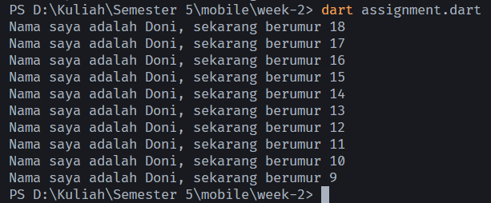

# #02 | Pengantar Bahasa Pemrograman Dart - Bagian 1

## NIM : 2241720015

## Nama : Doni Wahyu Kurniawawn

## Hands-on with Dart

1. Hello World with Dart

    ```dart
        void main() {
            for (int i = 0; i < 5; i++) {
                print('hello ${i + 1}');
            }
        }

    ```

    Output:\
    

2. Tugas Praktikum

    **Soal 1**\
    Modifikasilah kode pada baris 3 di VS Code atau Editor Code favorit Anda berikut ini agar mendapatkan keluaran (output) sesuai yang diminta!

    ```dart
        void main() {
            for (int i = 0; i < 10; i++) {
                print('hello ${1 + 2}');
            }
        }
    ```

    **Jawaban**

    ```dart
        void main() {
            for (int i = 0; i < 10; i++) {
                print('Nama saya adalah Doni, sekarang berumur ${18 - i}');
            }
        }
    ```

    **Output**\
    

    <p>&nbsp;</p>

    **Soal 2**\
    Mengapa sangat penting untuk memahami bahasa pemrograman Dart sebelum kita menggunakan framework Flutter? Jelaskan
    > Karena flutter sepenuhnya ditulis menggunakan bahasa Dart. Semua komponen, widget, dan fungsi dalam Flutter menggunakan sintaks dan struktur Dart. Tanpa pemahaman dasar tentang Dart, kita akan kesulitan memahami bagaimana Flutter bekerja.

    <p>&nbsp;</p>

    **Soal 3**\
    Rangkumlah materi dari codelab ini menjadi poin poin penting yang dapat Anda gunakan untuk membantu proses pengembangan aplikasi mobile menggunakan framework flutter
    > * **Apa itu Dart?** Dart merupakan dasar untuk bekerja dengan flutter, pengembang perlu untuk bagaiamana cara dart bekerja agar bisa tahu bagaimana flutter bekerja secara efektif.
    > * **Tujuan dart**: menggabungkan kelebihan kelebihan dari sebagian besar bahasa tingkat tinggi
    >   1. Productive tooling - menganalisis kode, plug-in dan ekosistem paket
    >   2. Garbage collection - mengelola deaokasi memori, sehingga beban aplikasi menjadi ringan
    >   3. Type annotations (opsional) - keamanan dan konsistensi data dalam aplikasi
    >   4. Statically typed - menggunakan fitur type-safe dan type interference untuk menganalisis types saat runtime
    >   5. Portability - dart dapat berjalan di web, ARM, dan X86
    > * **Evolusi Dart**
    >   1. Awalnya berfokus pada pengembangan web, sekarang telah fokus pada pengembangan mobile
    >   2. Mencoba memecahkan masalah pada javascript dan menjadi penerus dari javascript
    >   3. Menawarkan performa terbaik dand alat yang lebih baik untk proyek berskala besar
    >   4. Dibentuk agar kuat dan fleksibel dengan mempertahankan type annotations bersifak opsional dan menambahkan fitur OOP
    > * **Bagaimana Dart Bekerja**
    >   1. Dart dapat dieksekusi menggunakan dua cara, Dart virtual machines (VMs) dan Javascript compilations
    >   2. Eksekusi kode Dart dapat beroperasi dalam dua mode - kompilasi `Just-In-TIme (JIT)` atau kompilasi `Ahead-Of-Time (AOT)`
    > * **Struktur Bahasa Dart**
    >   1. OOP - Konsep objek yang menyimpan kedua data fields dan methods.  OBjek ini dibuat dari cetak biru yang disebut class.
    >   2. Dart Operators - Tidak lebih dari method yang didefinisikan dalam class dengan sintaks khusus, misal `x == y` sama saja dengan `x.==(y)`, jadi == merupakan sebuah method
    >   3. Arithmetic operators
    >       * `+`, `-`, `*`, `/`, `%`
    >       * `~/` untuk pembagian bilangan bulat
    >       * `-expression` untuk negasi
    >       * shortcut operators `+=`, `-=`, `*=`, `/=`, `~/=`
        4. Increment dan decrement
    >       * `++var` atau `var++`
    >       * `--var` atau `var--`
        5. Equality dan relation operator
            * `==`, `!=` tidak membandingkan referensi memori melainkan isi dari variable
            * `>`, `<`, `>=`, `<=`
        6. Logical Operator
            * `!expression` - Negasi
            * `||` - OR
            * `&&` - AND
    > * Main Function\
    Seperti kebanyakan bahasa modern, Dart menggunakan function dan method sebagai cara untuk memisahkan kode. Sebuah function atau method adalah potongan kode yang menerima beberapa data, eksekusi kode, dan kemudian mengembalikan beberapa data (return).
    Nama main digunakan oleh kode lain untuk merujuk pada nama method ini. Dalam kasus ini, main adalah nama function utama yang dicari oleh Dart VM saat pertama kali mengeksekusi kode. Setiap aplikasi Dart harus memiliki function main sehingga Dart VM tahu di mana harus memulai eksekusi kode.
