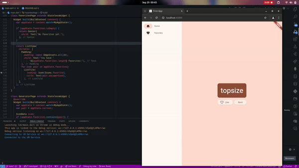

# #03 | Aplikasi Pertama dan Widget Dasar Flutter

## Doni Wahyu Kurniawan

## TI-3H | 2241720015 | 08

## Praktikum 1: Membuat Project Flutter Baru


## Praktikum 2: Menghubungkan Perangkat Android atau Emulator

\


## Praktikum 3: Membuat Repository Github dan Laporan Praktikum


## Praktikum 4: Menerapkan Widget

### Langkah 1 - Text Widget


### Langkah 2 - Image Widget


## Praktikum 5: Menerapkan Widget Material Design dan iOS Cupertino

### Langkah 1 - Cupertino Button dan Loading Bar

```dart
import 'package:flutter/material.dart';
import 'package:flutter/cupertino.dart';

class MyWidget extends StatelessWidget {
  @override
  Widget build(BuildContext context) {
    return MaterialApp(
      home: Container(
        margin: const EdgeInsets.only(top: 30),
        color: Colors.white,
        child: Column(
          children: <Widget>[
            CupertinoButton(
              child: const Text("Contoh button"),
              onPressed: () {
                // Add your onPressed code here
              },
            ),
            const CupertinoActivityIndicator(),
          ],
        ),
      ),
    );
  }
}
```

### Langkah 2 - Floating Action Button (FAB)

```dart
import 'package:flutter/material.dart';

class MyWidget extends StatelessWidget {
  @override
  Widget build(BuildContext context) {
    return MaterialApp(
      home: Scaffold(
        floatingActionButton: FloatingActionButton(
          onPressed: () {
            // Add your onPressed code here!
          },
          child: const Icon(Icons.thumb_up),
          backgroundColor: Colors.pink,
        ),
      ),
    );
  }
}
```

### Langkah 3 - Scaffold WidgetBar


### Langkah 4 - Dialog Widget


### Langkah 5 - Input dan Selection Widget


### Langkah 6 - Date and Time Pickers


## FLUTTER FIRST APP

1. Create a Project\
  
2. Add a button\
  
3. Make thing prettier\
  
4. Add Functionality\
  
5. Add Navigation Rail\
  
6. Add New Page\
  
