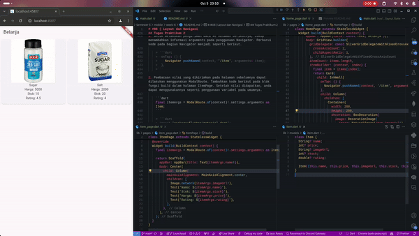

# #06 | Layout dan Navigasi

## Doni Wahyu Kurniawan

## TI-3H | 2241720015 | 08

## Praktikum 1: Membangun Layout di Flutter

### Langkah 1: Membuat Projek Baru

Buat Project Baru

### Langkah 2: Edit main.dart

```dart
import 'package:flutter/material.dart';

void main() => runApp(const MyApp());

class MyApp extends StatelessWidget {
  const MyApp({super.key});

  @override
  Widget build(BuildContext context) {
    return MaterialApp(
      title: 'Flutter layout: Doni Wahyu | 2241720015',
      home: Scaffold(
        appBar: AppBar(
          title: const Text('Flutter layout demo'),
        ),
        body: const Center(
          child: Text('Hello World'),
        ),
      ),
    );
  }
}
```

Hasil


### Langkah 3: Identifikasi Layout Diagram

Identifikasi layout

### Langkah 4: Implementasi Title Row

```dart
import 'package:flutter/material.dart';

void main() => runApp(const MyApp());

class MyApp extends StatelessWidget {
  const MyApp({super.key});

  @override
  Widget build(BuildContext context) {
    Widget titleSection = Container(
      padding: const EdgeInsets.all(...),
      child: Row(
        children: [
          Expanded(
            // soal 1
            child: Column(
              crossAxisAlignment: ...,
              children: [
                // soal 2
                Container(
                  padding: const EdgeInsets.only(bottom: ...),
                  child: const Text(
                    'Wisata Gunung di Batu',
                    style: TextStyle(
                      fontWeight: FontWeight.bold,
                      fontSize: 20.0,
                    ),
                  ),
                ),
                Text(
                  'Batu, Malang, Indonesia',
                  style: TextStyle(...),
                ),
              ],
            ),
          ),
          // soal 3
          Icon(
            ...,
            color:....,
          ),
          const Text(...),
        ],
      ),
    );

    return MaterialApp(
      title: 'Flutter layout: Doni Wahyu | 2241720015',
      home: Scaffold(
        appBar: AppBar(
          title: const Text('Flutter layout demo'),
        ),
        body: ListView(
          children: [
            titleSection,
            const Center(
              child: Text('Hello World'),
            ),
          ],
        ),
      ),
    );
  }
}

```

1. Letakkan widget `Column` di dalam widget `Expanded` agar menyesuaikan ruang yang tersisa di dalam widget `Row`. Tambahkan properti `crossAxisAlignment` ke `CrossAxisAlignment`.start sehingga posisi kolom berada di awal baris.

    ```dart
    // soal 1
    child: Column(
        crossAxisAlignment: CrossAxisAlignment.start,
    ```

2. Letakkan baris pertama teks di dalam `Container` sehingga memungkinkan Anda untuk menambahkan padding = 8. Teks `‘Batu, Malang, Indonesia'` di dalam `Column`, set warna menjadi abu-abu.

    ```dart
    // soal 2
    Container(
        padding: const EdgeInsets.only(bottom: 8),
            child: const Text(
                'Wisata Gunung di Batu',
                style: TextStyle(
                    fontWeight: FontWeight.bold,
            ),
        ),
    ),
    Text(
        'Batu, Malang, Indonesia',
        style: TextStyle(
            color: Colors.grey[500],
        ),
    ),
    ```

3. Dua item terakhir di baris judul adalah ikon bintang, set dengan warna merah, dan teks "41". Seluruh baris ada di dalam `Container` dan beri padding di sepanjang setiap tepinya sebesar 32 piksel. Kemudian ganti isi `body text ‘Hello World'` dengan variabel `titleSection`

    ``` dart
        // soal 3
            Icon(
                Icons.star,
                color: Colors.red[500],
            ),
            const Text('41'),
            ],
        ),
        );

        return MaterialApp(
            title: 'Flutter layout: Doni Wahyu | 2241720015',
            home: Scaffold(
                appBar: AppBar(
                title: const Text('Flutter layout demo'),
                ),
                body: Column(
                children: [titleSection],
                ),
            ),
        );
    ```

Hasil\


## Praktikum 2: Implementasi Button Row

### Langkah 1: Method Column _buildButtonColumn

```dart
  Column _buildButtonColumn(Color color, IconData icon, String label) {
    return Column(
      mainAxisSize: MainAxisSize.min,
      mainAxisAlignment: MainAxisAlignment.center,
      children: [
        Icon(icon, color: color),
        Container(
          margin: const EdgeInsets.only(top: 8),
          child: Text(label,
              style: TextStyle(
                fontSize: 12,
                fontWeight: FontWeight.w400,
                color: color,
              )),
        )
      ],
    );
  }
```

### Langkah 2: Widget buttonSection

```dart
    Color color = Theme.of(context).primaryColor;

    Widget buttonSection = Row(
      mainAxisAlignment: MainAxisAlignment.spaceEvenly,
      children: [
        _buildButtonColumn(color, Icons.call, 'CALL'),
        _buildButtonColumn(color, Icons.near_me, 'ROUTE'),
        _buildButtonColumn(color, Icons.share, 'SHARE'),
      ],
    )
```

### Langkah 3: Tambah Button ke Body

```dart
    body: Column(
        children: [titleSection, buttonSection],
    ),
```

Hasil\


## Praktikum 3: Implementasi Text Section

### Langkah 1: Widget textSection

```dart
  Widget textSection = Container(
    padding: const EdgeInsets.all(32),
    child: const Text(
      'Coban Rais adalah salah satu destinasi wisata yang menarik di Malang, Jawa Timur. '
      'Terletak di kaki Gunung Panderman, tempat ini menawarkan pemandangan alam yang indah dan udara yang menyegarkan. '
      'Coban Rais terkenal dengan air terjunnya yang spektakuler, yang merupakan daya tarik utama bagi wisatawan yang datang ke sini. '
      'Selain itu, tempat ini juga menawarkan berbagai kegiatan menarik seperti trekking dan berkemah. '
      'Hal ini membuatnya menjadi tempat yang sempurna untuk liburan keluarga, rekreasi, atau bahkan outbound.\n\n '
      'Doni Wahyu Kurniawan | 2241720015',
      softWrap: true,
    ),
  );
```

### Langkah 2: Tambah Variable textSection ke Body

```dart
  body: Column(
    children: [titleSection, buttonSection, textSection],
  ),
```

Hasil\


## Praktikum 4: Implementasi Image Section

### Langkah 1: Siapkan Aset Gambar

```dart
  uses-material-design: true
  assets:
    - images/coban_rais.png
```

### Langkah 2: Tambahkan Gambar ke Body

```dart
  body: ListView(
    children: [
      Image.asset(
        'images/coban_rais.png',
        width: 600,
        height: 240,
        fit: BoxFit.cover,
      ),
      titleSection,
      buttonSection,
      textSection
    ],
  ),
```

### Langkah 3: Ubah Column menjadi ListView

```dart
  body: ListView(
    children: [
```

Hasil\


## Tugas Praktikum 1


## Praktikum 5: Membangun Navigasi di Flutter

### Langkah 1: Membuat Projek Baru `belanja`

### Langkah 2: Mendefinisikan Route

Route Home Page

```dart
import 'package:flutter/material.dart';

class HomePage extends StatelessWidget {
  const HomePage({super.key});

  @override
  Widget build(BuildContext context) {
    throw UnimplementedError();
  }
}
```

Route Item Page

```dart
import 'package:flutter/material.dart';

class ItemPage extends StatelessWidget{
  const ItemPage({super.key});

  @override
  Widget build(BuildContext context) {
    throw UnimplementedError();
  }
}
```

### Langkah 3: Lengkapi main.dart

```dart
import 'package:belanja/pages/home_page.dart';
import 'package:belanja/pages/item_page.dart';
import 'package:flutter/material.dart';

void main() {
  runApp(MaterialApp(
    initialRoute: '/',
    routes: {
      '/': (context) => const HomePage(),
      '/item': (context) => const ItemPage(),
    }
  ));
}
```

### Langkah 4: Membuat Data Model

```dart
class Item {
  String? name;
  int? price;

  Item({this.name, this.price});
}
```

### Langkah 5: Lengkapi Kode di Class HomePage

```dart
  final List<Item> items = [
    Item(name: 'Sugar', price: 5000),
    Item(name: 'Salt', price: 2000),
  ];
```

### Langkah 6: Membuat ListView dan itemBuilder

```dart
  @override
  Widget build(BuildContext context) {
    return Scaffold(
      appBar: AppBar(title: const Text('Belanja')),
      body: Container(
        margin: const EdgeInsets.all(8),
        child: ListView.builder(
          padding: const EdgeInsets.all(8),
          itemCount: items.length,
          itemBuilder: (context, index) {
            final item = items[index];
            return Card(
              child: InkWell(
                onTap: () {
                  Navigator.pushNamed(context, '/item');
                },
                child: Container(
                  margin: const EdgeInsets.all(8),
                  child: Row(
                    children: [
                      Expanded(child: Text(item.name!)),
                      Expanded(
                        child: Text(
                          item.price.toString(),
                          textAlign: TextAlign.end,
                        ),
                      ),
                    ],
                  ),
                ),
              ),
            );
          },
        ),
      ),
    );
```

### Langkah 7: Menambahkan Aksi pada ListView

```dart
  return Card(
    child: InkWell(
      onTap: () {
        Navigator.pushNamed(context, '/item');
      },
```

Hasil\


## Tugas Praktikum 2

1. Untuk melakukan pengiriman data ke halaman berikutnya, cukup menambahkan informasi arguments pada penggunaan Navigator. Perbarui kode pada bagian Navigator menjadi seperti berikut.

    > ```dart
    >  onTap: () {
    >    Navigator.pushNamed(context, '/item', arguments: item);
    >  },
    >```
  
2. Pembacaan nilai yang dikirimkan pada halaman sebelumnya dapat dilakukan menggunakan ModalRoute. Tambahkan kode berikut pada blok fungsi build dalam halaman ItemPage. Setelah nilai didapatkan, anda dapat menggunakannya seperti penggunaan variabel pada umumnya.

    ```dart
    final itemArgs = ModalRoute.of(context)!.settings.arguments as Item;
    ```

    > ```dart
    > import 'package:flutter/material.dart';
    > import 'package:belanja/models/item.dart';
    >
    > class ItemPage extends StatelessWidget {
    >  const ItemPage({super.key});
    >
    >  @override
    >  Widget build(BuildContext context) {
    >    final itemArgs = ModalRoute.of(context)!.settings.arguments as Item;
    >
    >    return Scaffold(
    >      appBar: AppBar(title: Text(itemArgs.name!)),
    >      body: Center(
    >        child: Column(
    >          mainAxisAlignment: MainAxisAlignment.center,
    >          children: [
    >            Text('Nama: ${itemArgs.name}'),
    >            Text('Harga: ${itemArgs.price}'),
    >            // Implementasikan tampilan lainnya
    >          ],
    >        ),
    >      ),
    >    );
    >  }
    >}
    >```

    Hasil\
    

3. Pada hasil akhir dari aplikasi belanja yang telah anda selesaikan, tambahkan atribut foto produk, stok, dan rating. Ubahlah tampilan menjadi GridView seperti di aplikasi marketplace pada umumnya.
    > * Menambah atribut
    >
    >   ```dart
    >   class Item {
    >     String? name;
    >     int? price;
    >     String? imageUrl;
    >     int? stock;
    >     double? rating;
    >
    >     Item({this.name, this.price, this.imageUrl, this.stock, this.rating});
    >   }
    >   ```
    >
    > * GridView
    >
    >   ```dart
    >   import 'package:flutter/material.dart';
    >   import 'package:belanja/models/item.dart';
    >   
    >   class HomePage extends StatelessWidget {
    >     final List<Item> items = [
    >       Item(
    >         name: 'Sugar',
    >         price: 5000,
    >         imageUrl:
    >             'https://images.heb.com/is/image/HEBGrocery/005596030-1?jpegSize=150&hei=1400&fit=constrain&qlt=75',
    >         stock: 10,
    >         rating: 4.5,
    >       ),
    >       Item(
    >         name: 'Salt',
    >         price: 2000,
    >         imageUrl: 'https://images.heb.com/is/image/HEBGrocery/002105270-1',
    >         stock: 20,
    >         rating: 4.0,
    >       ),
    >     ];
    >   
    >     HomePage({super.key});
    >   
    >     @override
    >     Widget build(BuildContext context) {
    >       return Scaffold(
    >         appBar: AppBar(title: const Text('Belanja')),
    >         body: GridView.builder(
    >           gridDelegate: const SliverGridDelegateWithFixedCrossAxisCount(
    >             crossAxisCount: 2,
    >             childAspectRatio: 1,
    >           ),
    >           itemCount: items.length,
    >           itemBuilder: (context, index) {
    >             final item = items[index];
    >             return Card(
    >               child: InkWell(
    >                 onTap: () {
    >                   Navigator.pushNamed(context, '/item', arguments: item);
    >                 },
    >                 child: Column(
    >                   children: [
    >                     Container(
    >                       width: 200,
    >                       height: 200,
    >                       decoration: BoxDecoration(
    >                         image: DecorationImage(
    >                           image: NetworkImage(item.imageUrl!),
    >                           fit: BoxFit.cover,
    >                         ),
    >                       ),
    >                     ),
    >                     Text(item.name!),
    >                     Text('Harga: ${item.price}'),
    >                     Text('Stok: ${item.stock}'),
    >                     Text('Rating: ${item.rating}'),
    >                   ],
    >                 ),
    >               ),
    >             );
    >           },
    >         ),
    >       );
    >     }
    >   }
    >   ```
    >
    Hasil\
    

4. Silakan implementasikan Hero widget pada aplikasi belanja Anda

    > ```dart
    >   Hero(
    >     tag: item.name!,
    >     child: Image.network(
    >       item.imageUrl!,
    >       fit: BoxFit.cover,
    >       height: 300,
    >       width: double.infinity,
    >     ),
    >   ),
    > ```

5. Sesuaikan dan modifikasi tampilan sehingga menjadi aplikasi yang menarik. Selain itu, pecah widget menjadi kode yang lebih kecil. Tambahkan Nama dan NIM di footer aplikasi belanja Anda.

    

6. Selesaikan Praktikum 5: Navigasi dan Rute tersebut. Cobalah modifikasi menggunakan plugin go_router

    > * Tambah depedency
    >
    >   ```dart
    >   dependencies:
    >     flutter:
    >       sdk: flutter
    >     go_router: ^5.0.0 
    >   ```
    >
    > * Edit main.dart
    >
    >   ```dart
    >     final GoRouter _router = GoRouter(
    >       initialLocation: '/',
    >       routes: [
    >         GoRoute(
    >           path: '/',
    >           builder: (context, state) => HomePage(),
    >         ),
    >         GoRoute(
    >           path: '/item',
    >           builder: (context, state) {
    >             // Retrieve the passed item argument
    >             final item = state.extra as Item;
    >             return ItemPage(item: item);
    >           },
    >         ),
    >       ],
    >     );
    >   ```
    >
    > * Refactor item_page.dart
    >
    >   ```dart
    >   import 'package:flutter/material.dart';
    >   import 'package:belanja/models/item.dart';
    >   import 'package:belanja/widgets/item_image.dart';
    >   import 'package:belanja/widgets/item_detail.dart';
    >   
    >   class ItemPage extends StatelessWidget {
    >     final Item item;
    >   
    >     const ItemPage({super.key, required this.item});
    >   
    >     @override
    >     Widget build(BuildContext context) {
    >       return Scaffold(
    >         appBar: AppBar(title: Text(item.name!)),
    >         body: Column(
    >           crossAxisAlignment: CrossAxisAlignment.start,
    >           children: [
    >             ItemImage(imageUrl: item.imageUrl!),
    >             ItemDetail(item: item),
    >           ],
    >         ),
    >       );
    >     }
    >   }
    >   ```
    >
    > * Refactor item_card.dart
    >
    >   ```dart
    >   import 'package:flutter/material.dart';
    >   import 'package:belanja/models/item.dart';
    >   import 'package:go_router/go_router.dart';
    >   
    >   class ItemCard extends StatelessWidget {
    >     final Item item;
    >   
    >     const ItemCard({
    >       super.key,
    >       required this.item,
    >     });
    >   
    >     @override
    >     Widget build(BuildContext context) {
    >       return Card(
    >         child: InkWell(
    >           onTap: () {
    >             // Use GoRouter for navigation
    >             context.go('/item', extra: item);
    >           },
    >           child: Column(
    >             crossAxisAlignment: CrossAxisAlignment.start,
    >             children: [
    >               Hero(
    >                 tag: item.name!,
    >                 child: Image.network(
    >                   item.imageUrl!,
    >                   fit: BoxFit.cover,
    >                   height: 300,
    >                   width: double.infinity,
    >                 ),
    >               ),
    >               Padding(
    >                 padding: const EdgeInsets.all(8.0),
    >                 child: Text(
    >                   item.name!,
    >                   style: const TextStyle(
    >                     fontSize: 16,
    >                     fontWeight: FontWeight.bold,
    >                   ),
    >                 ),
    >               ),
    >               Padding(
    >                 padding: const EdgeInsets.symmetric(horizontal: 8.0),
    >                 child: Text('Harga: Rp${item.price}'),
    >               ),
    >               Padding(
    >                 padding: const EdgeInsets.symmetric(horizontal: 8.0),
    >                 child: Text('Stok: ${item.stock}'),
    >               ),
    >               Padding(
    >                 padding: const EdgeInsets.symmetric(horizontal: 8.0),
    >                 child: Text('Rating: ${item.rating}'),
    >               ),
    >             ],
    >           ),
    >         ),
    >       );
    >     }
    >   }
    >   ```
  