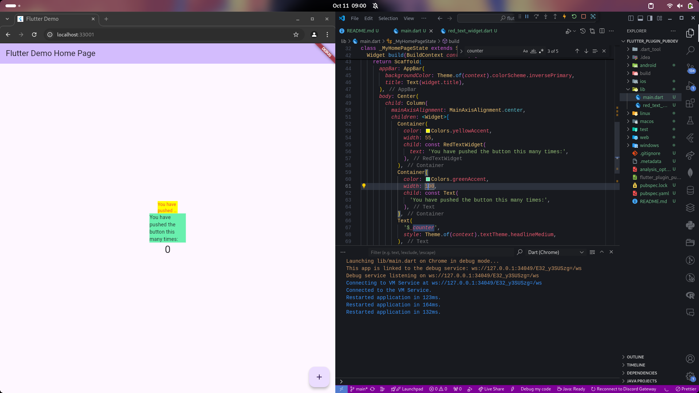

# #07 | Manajemen Plugin

## Doni Wahyu Kurniawan

## TI-3H | 2241720015 | 08

## Praktikum Menerapkan Plugin di Project Flutter

### Langkah 1: Create New Project - flutter_plugin_pubdev

### Langkah 2: Menambahkan Plugin

```console
    doni@fedora:/run/media/doni/>__</Kuliah/Semester 5/mobile/week-7/flutter_plugin_pubdev$ flutter pub add auto_size_text
```

### Langkah 3: Buat file `red_text_widget.dart`

```dart
import 'package:flutter/material.dart';

class RedTextWidget extends StatelessWidget {
  const RedTextWidget({Key? key}) : super(key: key);

  @override
  Widget build(BuildContext context) {
    return Container();
  }
}
```

### Langkah 4: Tambah Widget AutoSizeText

```dart
return AutoSizeText(
    text,
    style: const TextStyle(color: Colors.red, fontSize: 14),
    maxLines: 2,
    overflow: TextOverflow.ellipsis,
);
```

### Langkah 5: Buat Variabel Text dan Parameter di Constructor

```dart
final String text;

const RedTextWidget({Key? key, required this.text}) : super(key: key);
```

### Langkah 6: Tambahkan Widget di main.dart

```dart
      body: Center(
        child: Column(
          mainAxisAlignment: MainAxisAlignment.center,
          children: <Widget>[
            Container(
              color: Colors.yellowAccent,
              width: 55,
              child: const RedTextWidget(
                text: 'You have pushed the button this many times:',
              ),
            ),
            Container(
              color: Colors.greenAccent,
              width: 100,
              child: const Text(
                'You have pushed the button this many times:',
              ),
            ),
            Text(
              '$_counter',
              style: Theme.of(context).textTheme.headlineMedium,
            ),
          ],
        ),
      ),
```

### Hasil



## Tugas Praktikum

1. Jelaskan maksud dari langkah 2 pada praktikum tersebut!
    > Command `flutter pub add auto_size_text` digunakan untuk menambahkan dependensi `auto_size_text` ke dalam project Flutter. Dependensi ini memungkinkan penggunaan widget AutoSizeText yang secara otomatis menyesuaikan ukuran teks agar tetap pas dalam ruang yang dibuat.
2. Jelaskan maksud dari langkah 5 pada praktikum tersebut!

    > ```dart
    > final String text;
    > ```
    >
    > Deklarasi properti `text`\
    > `text` adalah sebuah properti bertipe String yang hanya bisa diatur sekali karena menggunakan final dan akan digunakan untuk menampilkan teks di dalam widget AutoSizeText
    >
    > ```dart
    > const RedTextWidget({Key? key, required this.text}) : super(key: key);
    > ```
    >
    > Konstruktor ini bertugas untuk menginisialisasi objek RedTextWidget dan memastikan bahwa properti text harus diisi saat membuat instance widget tersebut. `required` menandakan bahwa properti text wajib disertakan ketika widget ini dipanggil.
3. Pada langkah 6 terdapat dua widget yang ditambahkan, jelaskan fungsi dan perbedaannya!
    > 1. Jenis widget teks:
    >       * Widget pertama menggunakan RedTextWidget yang memanfaatkan AutoSizeText, yang memungkinkan teks untuk secara otomatis menyesuaikan ukuran agar muat di dalam ruang yang tersedia.
    >       * Widget kedua menggunakan Text standar, yang ukuran teksnya tetap dan tidak akan menyesuaikan dengan ruang yang ada.
    > 2. Ukuran ruang yang tersedia:
    >       * Pada widget pertama (RedTextWidget), ruang yang tersedia adalah lebar 50 piksel, dan ukuran teks akan disesuaikan agar muat dengan ruang tersebut, dengan maksimal 2 baris.
    >       * Pada widget kedua (Text), ruang yang tersedia adalah lebar 100 piksel, tetapi ukuran teksnya tetap, dan jika teks terlalu panjang, ia akan meluap atau terpotong.
    > 3. Tampilan teks saat ruang terbatas:
    >       * Pada widget pertama (AutoSizeText), teks akan diperkecil agar muat sesuai ruang dan bisa terpotong dengan ellipsis jika diperlukan.
    >       * Pada widget kedua (Text), teks bisa meluap jika ruang tidak cukup atau tetap pada ukuran yang ditentukan.

4. Jelaskan maksud dari tiap parameter yang ada di dalam plugin auto_size_text berdasarkan dokumentasi
    1. `key*`: Mengontrol bagaimana satu widget menggantikan widget lain dalam tampilan
    2. `textKey`: Define key untuk widget Text yang dihasilkan
    3. `style*`: Jika diisi, menentukan gaya teks (misalnya, ukuran, warna, font).
    4. `minFontSize`: Ukuran teks minimum ketika menggunakan penyesuaian otomatis ukuran teks.
    5. `maxFontSize`: Ukuran teks maksimum ketika menggunakan penyesuaian otomatis.
    6. `stepGranularity`: Ukuran langkah perubahan font ketika menyesuaikan ukuran font dengan batasan.
    7. `presetFontSizes`: Daftar ukuran font yang sudah ditentukan, harus diurutkan dari besar ke kecil.
    8. `group`: Mensinkronisasi ukuran beberapa AutoSizeText agar sama.
    9. `textAlign*`: Menentukan bagaimana teks diratakan secara horizontal (misalnya, kiri, tengah, kanan).
    10. `textDirection*`: Menentukan arah teks (misalnya, kiri ke kanan atau sebaliknya).
    11. `locale*`: Memilih font berdasarkan wilayah, karena karakter Unicode dapat berbeda tampilan tergantung device lokal.
    12. `softWrap*`: Menentukan apakah teks dapat dipotong pada line break yang lembut.
    13. `wrapWords`: Menentukan apakah kata-kata yang tidak muat di satu baris akan dipotong. Defaultnya true.
    14. `overflow*`: Mengatur bagaimana teks yang lebih dari batas ruang ditampilkan.
    15. `overflowReplacement`: Widget pengganti yang ditampilkan jika teks tidak muat dalam batasnya.
    16. `textScaleFactor*`: Menentukan skala ukuran font berdasarkan piksel logis. Juga memengaruhi minFontSize, maxFontSize, dan presetFontSizes.
    17. `maxLines`: Jumlah maksimal baris yang bisa digunakan oleh teks.
    18. `semanticsLabel*`: Label alternatif untuk teks ini yang digunakan untuk accessibility.

    Parameter yang ditandai dengan * memiliki perilaku yang sama persis seperti widget Text
